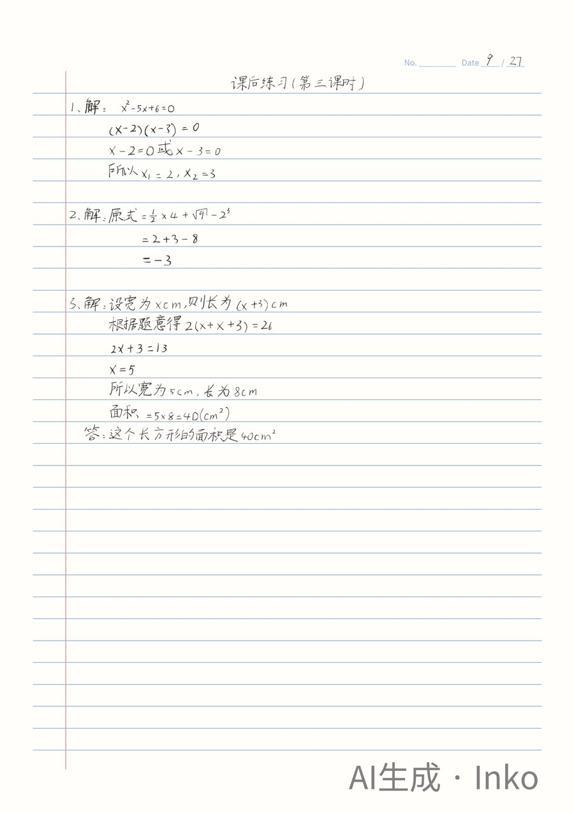
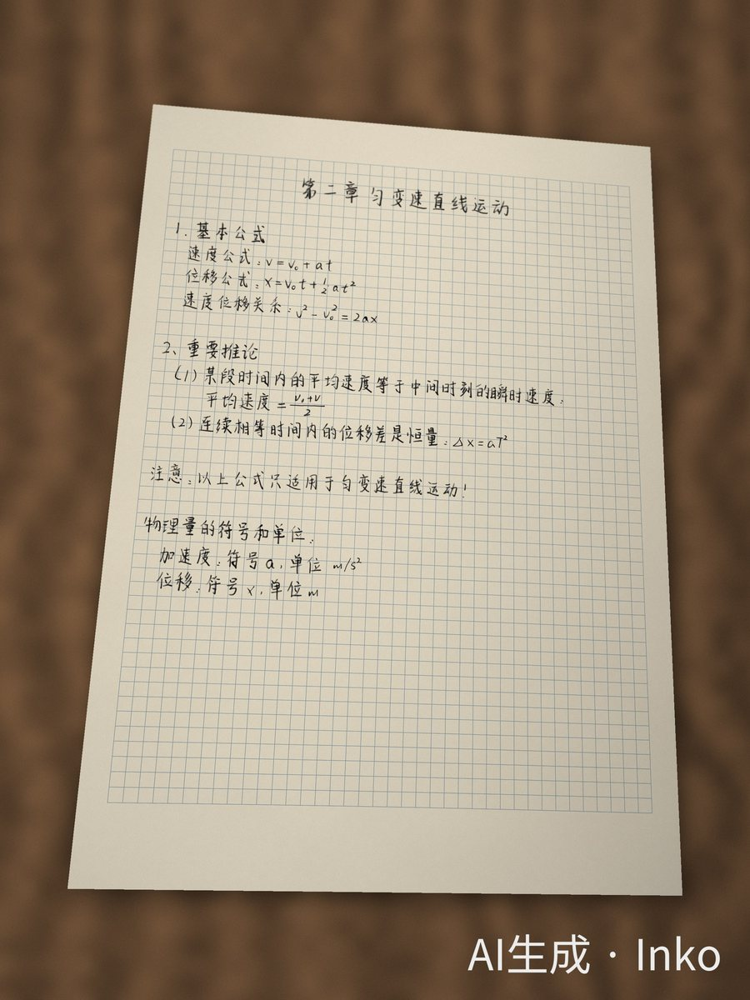
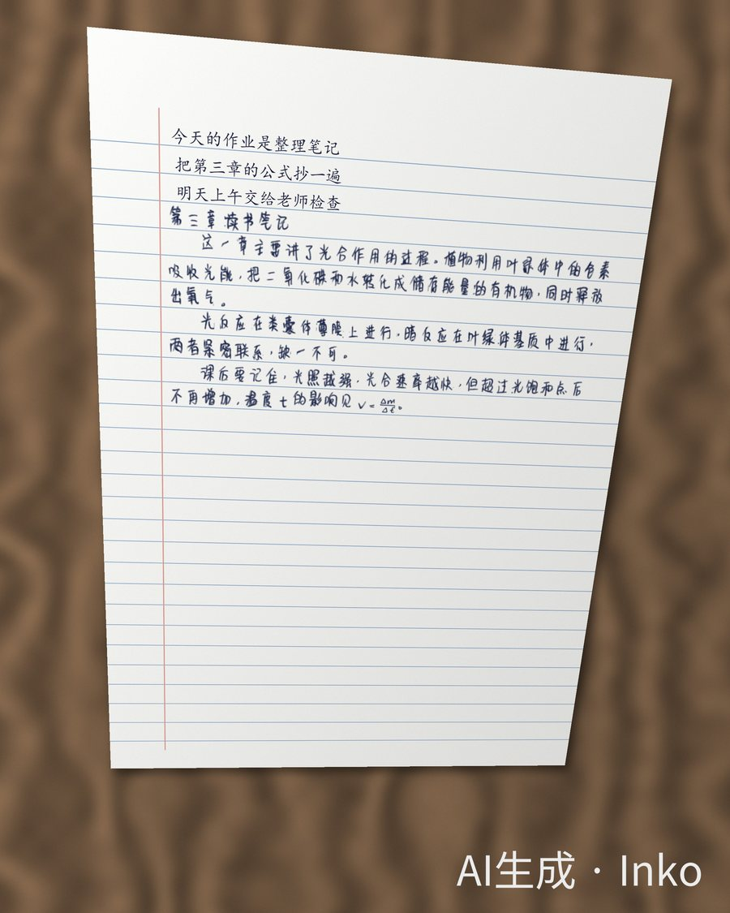
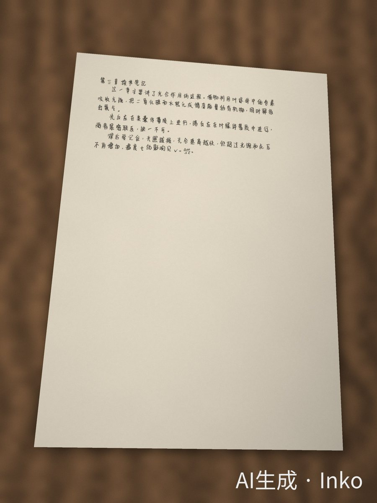
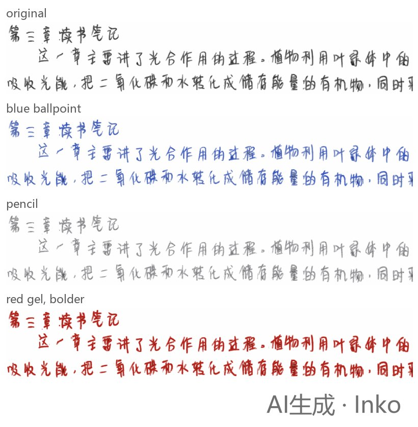

# Inko Handwriting — an Agent Skill

**[中文说明 → README.zh-CN.md](README.zh-CN.md)**

Give your AI agent a pen. With this skill, Claude Code, Codex, Cursor, GitHub Copilot, Gemini CLI, OpenCode and other
agents that read `SKILL.md` can turn notes, letters, essays and full math solutions into **real handwriting** with the
[Inko](https://inkotype.com) API — and then make it look like what you actually need:

- written **exactly on the lines of your own notebook paper** (from a phone photo: tilt, curl and perspective followed)
- a **phone photo** or **scan** of the page, a **PDF**
- **answers filled into the blanks** of a worksheet
- another **ink colour, pen type or stroke weight**, without paying again

Your agent solves the math like a student would, asks you the few things that matter (how detailed, which handwriting,
which paper, which pen, the price), and only then writes.

| Homework, solved and hand-written | Answers filled into a worksheet photo | Notes on squared paper, as a phone photo |
|---|---|---|
|  |  |  |

| On your own notebook page | As a phone photo | Other pens and colours |
|---|---|---|
|  |  |  |

All examples were made by AI agents following this skill in our tests; every image keeps Inko's AI-generation label.

> "帮我把这 5 道题做完，写在我的作业本上" + a photo of the problems + a photo of the exercise book
> "Turn notes/chapter3.md into a handwritten PDF on squared paper, blue ballpoint"
> "Write this letter on cream letter paper and make it look like a photo on my desk"

## Use it (for people)

1. Create an API key at **https://inkotype.com** → 账户 → API key. A separate key for your AI with a daily spending limit
   is a good idea.
2. Send your AI agent this repository link and the key, e.g.
   *"Install the handwriting skill from https://github.com/pretend1111/inko-skill — my Inko API key is ink_live_…"*
3. Ask for handwriting. The agent always shows you the price before anything is charged
   (¥0.002 per character, i.e. ¥2 per 1000, at least 100 characters per job; quotes and previews are free). It is pure
   pay-as-you-go from your Inko balance — no subscription or membership; new accounts get ¥3 to try it out.
4. Optional: in the website's 字迹库, set a **常用字迹** (your default handwriting) and ★ favourites. The agent writes in
   your 常用字迹 unless you ask for another, and picks from your favourites when it has to choose. Say
   *"以后都用这个字迹"* and it saves the new one for you.
5. Optional: **your own handwriting** (专属字迹). Buy a custom-handwriting seat on the website (¥19.9, one-off, never
   expires; one seat = one custom handwriting) and enrol your samples there; the agent can then write in it (Lyric 1).

## For AI agents: how to install this skill

Do these steps in the user's project folder. Don't print the API key back to the user and don't write it into project
files or commits.

1. **Get the files** (a temporary folder is fine):
   ```bash
   git clone --depth 1 https://github.com/pretend1111/inko-skill.git inko-skill-src
   ```
   No git? Download and unzip `https://github.com/pretend1111/inko-skill/archive/refs/heads/main.zip`.
2. **Install** (needs Python 3.9+; installs Pillow + numpy if missing):
   ```bash
   python inko-skill-src/install.py                 # this project (use python3 if python is Python 2)
   python inko-skill-src/install.py --scope user    # or: for all of the user's projects
   ```
   It detects your agent and copies `inko-handwriting/` to `.claude/skills/` (Claude Code) or `.agents/skills/`
   (Codex, Cursor, GitHub Copilot, Gemini CLI, OpenCode, goose, Amp); `--agent claude|agents|both` overrides. It prints
   JSON with `installed_to` and the next steps. You may delete `inko-skill-src` afterwards.
3. **Save the key** the user gave you — piped on stdin so it stays out of the argument list:
   ```bash
   printf '%s' 'ink_live_…' | python <installed_to>/scripts/inko.py auth
   ```
   PowerShell: `'ink_live_…' | python <installed_to>\scripts\inko.py auth`. It is verified and stored in the user's
   config folder (`~/.config/inko/key`, `%APPDATA%\inko\key`); `--project` stores it in `./.inko/key` (git-ignored)
   instead. Alternatively the user can set the environment variable `INKO_API_KEY`.
4. **Check**: `python <installed_to>/scripts/inko.py doctor` → `"ok": true`, key valid, balance shown.
5. **Start**: read `<installed_to>/SKILL.md` now and follow it — some agents only list a new skill after a restart,
   but you don't need to wait. Tell the user it's ready, where the key is stored, and suggest a daily spending limit on
   the key (website → 账户 → API key).

Updating later: run steps 1–2 again (the installed copy is replaced; the key is not touched).

## What's inside

```
inko-handwriting/
  SKILL.md                 workflow, rules, when to ask the user, which tool for which job
  references/              scenario recipes, writing math like a student, symbol table, layouts,
                           handwriting choice, own-paper matching, post-processing, API, troubleshooting
  assets/layouts/          letter, homework (ruled), notes, essay (作文纸), worksheet-answers templates
  scripts/
    inko.py                API client: doctor, auth, styles (+ favourites), default-style, previews, quote, layout(+preview), generate, wait, rewrite …
    preview.py             free local preview of a layout
    ink.py                 recolour / re-weight / re-texture handwriting, extract a transparent ink layer
    paper.py               analyse a photo of ruled paper, find worksheet blanks, straighten photos, draw papers
    compose.py             put handwriting onto the user's paper (line-snapped), a worksheet, or any image
    photo.py               phone-photo / scan / photocopy look
    pdf.py                 images → PDF at real paper size
install.py                 installer for all agents
tests/                     offline tests with synthetic paper photos
evals/                     realistic agent tasks (math homework photo, own notebook page, notes → PDF + photo,
                           worksheet answers) with inputs and an outcome grader
```
`inko.py` needs only the Python standard library; the image scripts need Pillow and numpy (OpenCV optional).
Everything except `inko.py` runs locally and never uploads your images.

## Money, keys, labels

- **Nothing is charged without a confirmed quote**: `inko.py generate` only quotes unless the agent adds `--yes`, and the
  skill tells the agent to get your OK (or stay within a budget you gave) first. Failed/canceled jobs are refunded; one
  free re-write per job.
- **Your key** stays on your machine (user config folder or `./.inko/key`, git-ignored). Revoke it on the website any time.
- **AI labels**: every Inko page carries a visible 「AI生成 · Inko」 label and hidden AIGC metadata as required by Chinese
  law (GB 45438-2025). The scripts keep both on every derived image and PDF and re-apply the visible label at the
  required size; please don't remove them. Pages without the visible label are only available to accounts that
  bought a custom-handwriting seat and signed the AI-labelling agreement on the website (the metadata stays).
- Inko refuses IOUs, receipts, contracts, certificates, leave notes and signatures (not charged).

## Development

```bash
python tests/run_tests.py          # offline: synthetic notebook photos, paper detection, compose, photo, pdf, labels
INKO_API_KEY=… python tests/run_tests.py --online   # + free API checks (doctor, quote, layout)
```

MIT licensed. Inko and the Inko API are a service of inkotype.com; using the API requires an account and follows its
terms.
